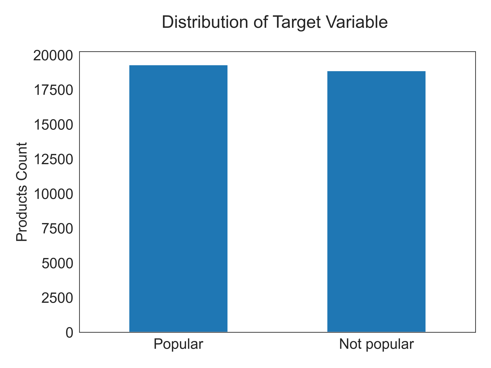
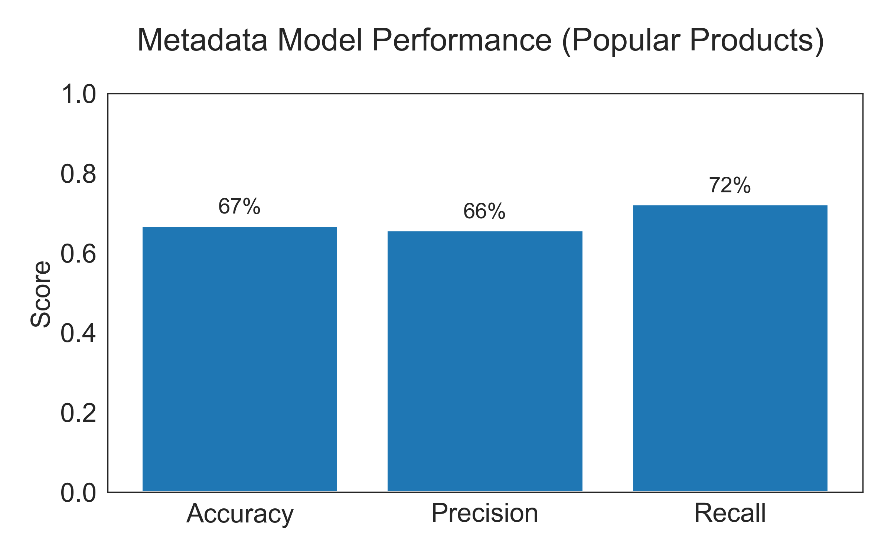
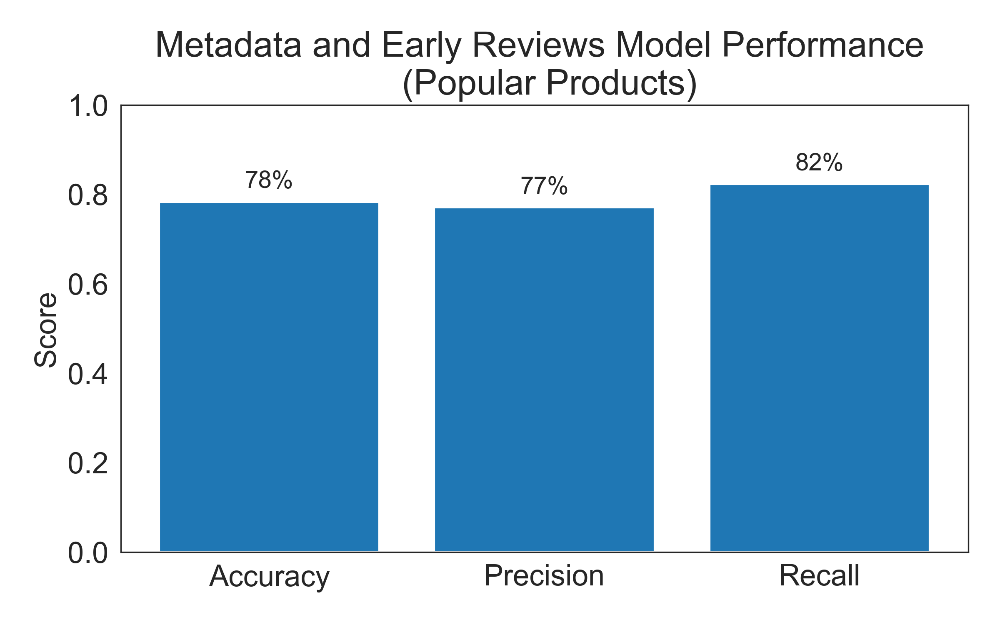

## Predicting Product Popularity and Generating Content Based Recommendations using Bayesian Ratings
### A data science capstone project at Brain Station
=========================

## Table of Contents
1. [Project Overview](#project-overview)
2. [Dataset Description](#dataset-description)
3. [Why Bayesian?](#why-bayesian)
4. [Metadata Cleaning](#metadata-cleaning-and-preprocessing)
5. [Early Reviews](#early-reviews-preprocessing)
6. [Model Insights](#key-insights-from-modeling)
7. [Stakeholder Utility](#model-utility-for-stakeholders)
8. [Recommender System](#recommender-system)
9. [Project Organization](#project-organization)
10. [Data Dictionary](#data-dictionary)

## Project Overview
This project tackles two critical challenges in e-commerce:

**Popularity Prediction**: Can we predict a product’s success using metadata and early ratings? 

In today’s hypercompetitive e-commerce landscape, both sellers and platforms struggle to anticipate product success. Traditional methods rely on post-launch sales data, making it difficult to optimize inventory and marketing strategies proactively. We develop a two-stage popularity prediction framework to transition from reactive to proactive decision-making.

**Stage 1: Metadata-Only Prediction**  
The stage relies solely on pre-launch metadata – product categories, seller history, category performance, product attributes – to provide early risk assessment before a single customer interacts with the listing. 

**Stage 2: Early Ratings Enhancement**  
In the second stage, we integrate the first five customer ratings to enhance our understanding of product reception. Early user reviews often serve as strong indicators of long-term performance, and incorporating them into the prediction model allows businesses to quickly refine their marketing, pricing, and inventory strategies.

*Business Impact* : Better popularity predictions reduce financial losses from poor inventory decisions, which can cost businesses $1.1 trillion annually.

**Recommendation System**: 
 We build a hybrid recommender model combining:

- Textual similarity (NLP on product titles/categories)

- Bayesian ratings (confidence-weighted scores)

- Business logic (price sensitivity, rating counts)

This recommendation engine balances textual similarity with Bayesian-adjusted ratings to surface high-potential products.

*Business Impact*: Personalized recommendations drive repeat purchases, improving customer retention and sales growth. 

## Dataset Description
This project leverages the [Amazon Reviews 2023 dataset](https://huggingface.co/datasets/McAuley-Lab/Amazon-Reviews-2023/tree/main/raw) focusing on the Handmade items category. Amazon Review 2023 is an updated version of the Amazon Review 2018 dataset and includes richer, cleaner metadata with more precise timestamps. With over 600k reviews and 400MB of metadata, this dataset provides a strong foundation for analyzing product popularity and recommendation strategies. The dataset consists of two key components:
- Metadata: Contains product titles/descriptions, categories, price, store etc. This data is used for Stage 1 popularity prediction and to generate content-based recommendations.
- Reviews: Includes customer reviews and text feedback. These are incorporated in Stage 2, where early user ratings help refine popularity predictions.

Due to computational constraints, we work with a sub-sampled version of the dataset in this project. However, our approach is designed to scale and can be extended to the full dataset with appropriate resources.

## Why Bayesian?
Imagine two competing products on Amazon: a new listing with a perfect 5-star rating from just 2 reviews and an established product with a 4.8-star average from 500 reviews. A simple average would rank the new product higher, despite its unreliable sample size.

Bayesian ratings correct this by weighting each product’s score against the global average (4.49 in our dataset). Initially, all products start at this baseline, gradually shifting toward their true rating as more reviews accumulate. The adjustment depends on the number of reviews relative to our trust threshold of 20 ratings (the 75th percentile in our dataset).

A product with only 2 ratings at 5 stars will have its rating pulled toward 4.5, while a well-reviewed 4.8-star product with 500 ratings remains stable. The formula used is:

`Adjusted = ( (avg_rating × rating_count) + (global_avg × trust_threshold) ) / (rating_count + trust_threshold)`

By applying Bayesian ratings, we define a balanced binary target for popularity prediction, turning this into a classification problem. We set a threshold of 4.5 to determine whether an item is considered popular or not.

## Metadata Cleaning and Preprocessing

The metadata required extensive cleaning, particularly for text-based columns such as product categories and product details, to extract meaningful features. The product categories are represented hierarchically in the dataset, with some products having up to five levels of subcategories. To make this information usable in our model, we :

- Cleaned labels associated with different subcategories to ensure consistency and avoid repetitive representations.
- Created a `combined_category` column by merging the first two levels of the subcategory hierarchy to ensure no missing values.

Product details, such as date first available, package dimensions, weight, department, and features, are provided as a list of dictionaries in the "details" column. We unpacked this information into individual columns to create suitable features for our model.

### Feature Engineering

A key challenge when working with product metadata is the limited number of numerical features available for the model. As a result, significant effort was put into feature engineering. Key findings from the exploratory data analysis (EDA) process highlighted that store and product category play an important role in determining product popularity. Therefore, we:

- Built new features using store and category-based aggregates of Bayesian ratings, which represent store/category popularity, store/category stability using coefficient of variation, store sizes, and product counts.
- Created a special flag for `generic` store names, which appeared to be placeholders for missing store information.
- Calculated product ages using the column `date_first_available`.
- Created new feature representing the number of images shown on the product page, as we weren't directly utilizing product images in our model.

### Text Preprocessing

We integrated product features into our model by applying Natural Language Processing (NLP) techniques for text vectorization. A new feature was created by combining the product title, description, and product features into a single column. This column was then vectorized using TF-IDF. To enhance the vectorization process, we built a custom tokenizer to clean the text data effectively. Although we experimented with word embeddings from a pre-trained model, the results did not significantly improve the model’s performance, so we decided to exclude this approach from our analysis.

## Early Reviews Preprocessing

For Stage 2 of our popularity prediction, we created features like early_rating_avg (average of the first 5 ratings) and early_verified_ratio (ratio of verified purchases in the first 5 reviews).

The verified purchase ratio is crucial as it can help identify fake reviews, with verified reviews generally being more trustworthy. We also included sentiment scores from the review title and text using Vader Sentiment analysis.

These features helped provide early insights into product reception, aiding the model in predicting product popularity more effectively.

## Key Insights from Modeling
We achieved similar model performances using a Logistic Regression and Random Forest model for meta data modeling, achieving a total accuracy of 66% which is about 18% improvement over random-guessing(50-50 split on target). Incorporating early reviews significantly enhanced its ability to distinguish between popular and unpopular products, increasing accuracy to 78%.

  
  

Using only metadata features, the model achieved a precision of 66% for identifying popular products but struggled with recall, leading to a higher misclassification rate for truly popular items. Incorporating early reviews improved precision for popular products from 66% to 72% while also increasing recall, ensuring fewer truly popular items were misclassified.

A key driver of the model’s performance was the engineering of numerical features, such as aggregated Bayesian ratings, store and category-based metrics, and product-specific attributes. These engineered features played a more significant role in enhancing model performance than text-based features, which had a more limited impact. 

Overall, the model’s performance aligns with industry benchmarks for metadata-based models (Linden et al., 2017; Wang et al., 2020; Chen et al., 2023). To further enhance performance, incorporating more diverse and meaningful features could be beneficial. Potential improvements include utilizing neural networks to capture complex patterns in the data, expanding the feature space with additional attributes such as user behavior patterns, brand verification from external sources, and product image analysis using image embeddings.

## Model Utility for Stakeholders
We also evaluated the model’s impact on different stakeholders to assess its practical value and identify areas for improvement. The model’s ability to classify products as popular or unpopular has distinct implications for customers, sellers, and amazon.

For **customers**, maximizing precision (i.e., reducing false positives) is crucial, as it ensures that recommended products are of high quality and worth purchasing. False positives in product recommendations could lead to customers being shown items that don’t meet their expectations, which can reduce satisfaction.

For **sellers**, the priority is minimizing false negatives (i.e., maximizing recall), as it prevents high-quality products from being overlooked or underexposed. False negatives could lead to good products not getting the attention they deserve, resulting in missed sales opportunities.

For **platform operators** like Amazon, maximizing precision for unpopular products (e.g., the top 5% of unpopular products) can assist in improving fraud detection and content moderation. Ensuring that low-quality or fraudulent products are flagged early can help maintain the integrity of the platform.

Given the current performance, the model is best suited for applications where a balance between precision and recall is required. This includes helping customers discover high-quality products while ensuring sellers have adequate visibility for their products. However, depending on the primary stakeholder’s needs, the decision threshold could be adjusted. For example, a customer-focused application might prioritize higher precision, while a seller-focused one might optimize for recall to reduce missed opportunities.

## Recommender System

The recommender system combines content-based and numeric-based approaches to provide more relevant recommendations to users. It integrates text similarity using TF-IDF with weighted numerical features like Bayesian ratings and product price, ensuring recommendations are not only similar in content but also well-rated and appropriately priced.

To support new products, the system guarantees at least one recommendation from items considered “new” (with a product age below a threshold). This ensures a balance between popular products and newer items gaining market traction. 

Key Features:
- Text Similarity: TF-IDF vectorization to calculate content-based similarities.
- Bayesian Ratings: Prioritizes products with reliable, higher ratings.
- Product Price: Considers less expensive products alongside popular ones.
- New Product Visibility: Ensures recommendations include at least one new product.

This approach enhances recommendations by blending text similarity with key business factors, while promoting newer products, all accessible through an interactive Streamlit interface.

## Project Organization

**Repository :**

* `data` 
    - contains link to the datasource

* `models`
    - `joblib` dump of final model(s)

* `notebooks`
    - contains all final notebooks involved in the project

* `visualizations`
    - Contains key figures and plots generated during analysis and modeling

* `docs`
    - Final report, presentations made as a part of BrainStation DataScience Bootcamp

* `.gitignore`
    - Part of Git, includes files and folders to be ignored by Git version control

* `amazon_reviews.yml`
    - Conda environment specification

* `README.md`
    - Project landing page (this page)

* `LICENSE`
    - Project license

## Data Dictionary

This is the final data dictionary containing all the features used for metadata and early reviews modeling.

| Column Name                             | Description  |
|------------------------------------------|-------------|
| is_popular                               | Binary target variable (1 = popular, 0 = not popular), based on Bayesian-adjusted rating threshold (≥ 4.5). |
| num_product_images                       | Number of images associated with the product listing. |
| product_features                         | Extracted product attributes from metadata. |
| product_title_length                     | Number of characters in the product title. |
| is_generic_store                         | Binary flag indicating whether the product is sold by a generic/unbranded store. |
| log_store_product_counts                 | Log-transformed count of products offered by the same store. |
| store_rating_mean                        | Average rating of all products sold by the store. |
| store_rating_std                         | Standard deviation of ratings for all products sold by the store. |
| store_rating_cv                          | Coefficient of variation (CV = std/mean) of store ratings, measuring rating consistency. |
| store_size_tier                          | Categorical variable classifying stores based on their number of listings. |
| store_target_encoded                     | Target-encoded representation of store popularity. |
| product_age_days                         | Age of the product listing in days since its first appearance. |
| is_weekend_release                       | Binary flag indicating if the product was launched on a weekend. |
| log_price                                | Log-transformed product price for scale normalization. |
| subcategory1_rating_mean                 | Average rating of products within the first subcategory. |
| subcategory1_rating_std                  | Standard deviation of ratings within the first subcategory. |
| subcategory1_rating_cv                   | Coefficient of variation for ratings within the first subcategory. |
| combined_category_rating_mean            | Mean rating across all broader category levels. |
| combined_category_rating_std             | Standard deviation of ratings across all broader category levels. |
| combined_category_rating_cv              | Coefficient of variation for broader category ratings. |
| log_combined_category_product_counts     | Log-transformed count of products within the broader category. |
| subcategory1_target_encoded              | Target-encoded representation of subcategory popularity. |
| combined_category_target_encoded         | Target-encoded representation of broader category popularity. |
| early_rating_avg                         | Average of the first 5 customer ratings. |
| early_verified_ratio                     | Proportion of early reviews marked as "verified purchase". |
| early_sentiment                          | Sentiment score (e.g., polarity) of early review text. |
| early_review_title_word_counts           | Word count in the titles of the first 5 reviews. |
| early_review_text_word_counts            | Word count in the full text of the first 5 reviews. |